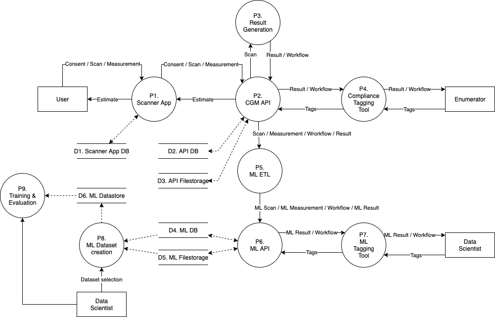
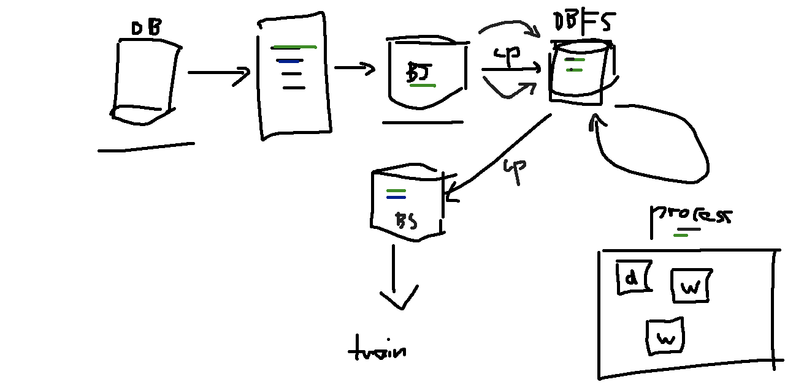

# Dataset Generation with Databricks

## Databricks architecture

How does databricks integrate with our overall architecture?

Caption: Overall architecture

`P8` is implemented by databricks.
It connects to a `D4` (ML DB) and `D5` (ML Filestorage)
and generates a dataset that it puts into `D6` ML Datastore.

Caption: Databricks internal process

* Database (`DB`)
* Blob storage (`BS`)
* copy (`cp`)
* Databricks File System (`DBFS`)
* Driver (`d`)
* Worker (`w`)

## Using utilities from cgm-ml in a Databricks notebook

The git integration in Databricks is not well-integrated yet.
Our current strategy is:
We move the transformation code into our codebase
We release cgm-ml-common on PyPI
We install cgm-ml-common in Databricks (driver and worker)
We import our transformation functionality

## Git version control of a single notebook

A single notebook can be saved into git easily with the `Repos` Databricks integration. When changing a Databricks notebook, make sure to commit&push the changes from the Databricks-UI.
