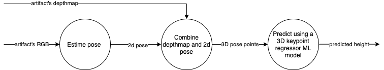

# Height prediction via 3d pose points

## Steps

Steps
1. Pose estimation
    * We run pose estimation to get the 2D child pose.
      This pose is comprised of all the joints' coordinates.
    * HRNET2D detects persons in RGB image and calculates simplified skeleton coordinates in pixels.
Our HRNet3D uses depthmap to convert the information into metrical space
2. Combine depthmap and 2d pose
    * We upscale the depthmap into RGB image resolution to have the data in the same coordinate system.
    * Using lens calibration and z coordinate from depthmap ([pin-hole camera](https://en.wikipedia.org/wiki/Pinhole_camera)), we transform 2D poses into 3D metrical space.
    * Using device camera pose (based on [SLAM](https://en.wikipedia.org/wiki/Simultaneous_localization_and_mapping)), we transform the 3D pose to have Y-axis always pointing to sky.
    * After this, we are enabled to detect the biggest horizontal plane in the depthmap (floor) and set the zero Y-coordinate to the floor level.
3. 3D keypoint regressor ML model
    * An ML regressor that takes an artifact's 3d points and builds ML-features from it that are then used for predicting the child's height
    * training and inference are quite fast
    * Also see model readme: `cgmml/models/Pose3dPoints/Pose3dPoints_height/m2021q4_randomforest/src/README.md`
    * There are 2 models, one model for standing children, one model for lying children

## Edge cases

When multiple-persons are detected on an artifact, we will not predict any height values, but instead we will disregard this artifact.
