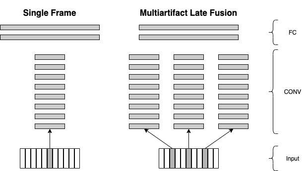

# Report for Experiment: q3-depthmapmultiartifactlatefusion-plaincnn-height

This report summarizes our experiment, which uses depthmaps as input data
for height prediction. We use a Convolutional Neural Network (CNN).

## Related work

[Large-scale Video Classification with Convolutional Neural Networks](https://static.googleusercontent.com/media/research.google.com/en//pubs/archive/42455.pdf) introduces the idea of early and late fusion.

Figure: In the bottom, there is a video containing multiple frames. "Single Frame" only uses a single frame to make a prediction. "Late Fusion" uses multiple frames where each frames is processed by a network independently and only in the end (a.k.a. late) the results are combined to a single prediction.

Figure: Comparison between ”Single Frame” CNN and Multiartifact LateFusion

## Approach

We use the "late fusion" idea in our approach.

This approach introduced a way for combining multiple frames of a video.

### Sampling

We sample `N` artifacts from a scan.
In practice `N=5` gives the best results for us.
We compare 2 different sampling strategies:

- sliding window
- systematic sampling

### Architecture

For the neural network architecture, we divide the neural network into a **base network** and a **network head**.

The Figures show the convolutional layers of the base network and the fully-connected layers of the network head.
The base network is shared by all the `N` artifacts.
Each artifact uses the same base network.
This can also be viewed as a feature extraction,
i.e., features are extracted for each artifact.
To combine the features of multiple artifacts, we concatenate all features.

The network head is composed of dense layers that should combine and weigh the features.

### Pretraining

Using the single artifact approach, we trained a network (Experiment is called `q3-depthmap-plaincnn-height`).
This network achieves a `min(val_mae)` of `1.96cm` to `2.21cm`.

We use all but the last layer(s) of this network to initialize our base network.

We initialize the network head randomly.

We freeze the base network in order to keep the well-trained parameters.

## Results

This baseline achieved a `min(val_mae)` of `1.96cm`.

This approach achieved a `min(val_mae)` of `0.53cm` (
see [q3-depthmapmultiartifactlatefusion-plaincnn-height-95k - Run 6](https://ml.azure.com/experiments/id/f42711e3-7642-426d-ba53-a616a07e076b/runs/q3-depthmapmultiartifactlatefusion-plaincnn-height-95k_1614177517_ecd7b6e2?wsid=/subscriptions/9b5bbfae-d5d1-4aae-a2ca-75159c0c887d/resourceGroups/cgm-ml-prod-we-rg/providers/Microsoft.MachineLearningServices/workspaces/cgm-ml-prod-we-azml&tid=3a27c573-ec1a-4734-9cd3-3208af51794b)
)
- This was trained on all codes.

## Future work

* the paper mentions that "Slow Fusion" gives the best results
